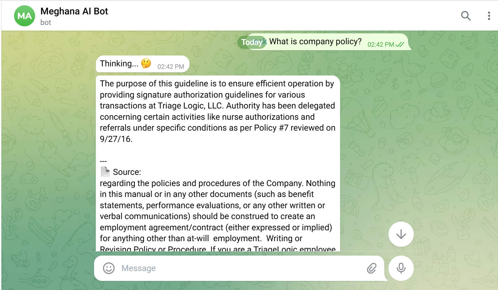
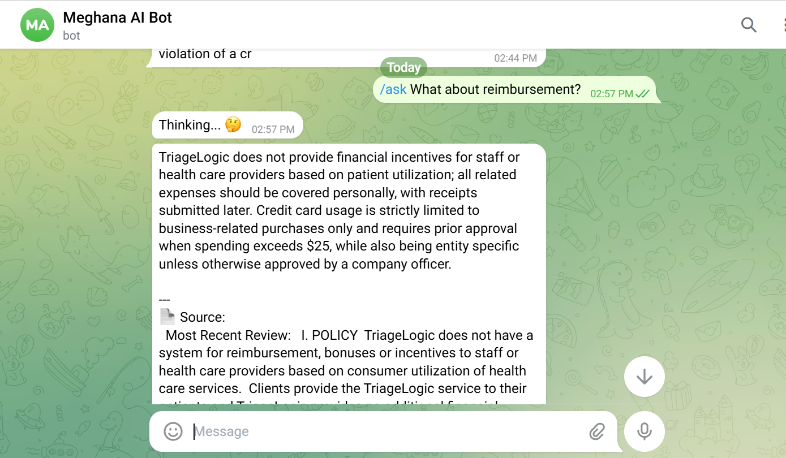
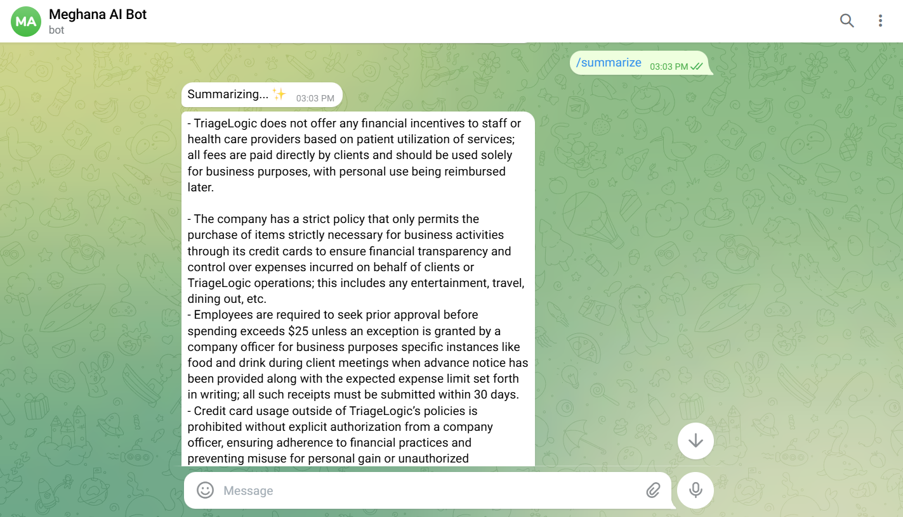

# Telegram RAG Bot using Ollama and FAISS

## 📌 Overview

This project is a lightweight GenAI Telegram bot that answers user
queries using Retrieval-Augmented Generation (RAG). It retrieves
relevant information from a PDF knowledge base and generates responses
using a local LLM.

------------------------------------------------------------------------

## 🚀 Features

-   📄 PDF-based knowledge retrieval
-   🤖 Telegram bot interface
-   🔍 Semantic search using embeddings
-   ⚡ Fast retrieval using FAISS
-   🧠 Local LLM using Ollama (phi3)
-   📚 Source citations for transparency
-   💬 Conversation history (last 3 queries)
-   ⚡ Caching for faster repeated queries
-   ✨ `/summarize` command for response summarization

------------------------------------------------------------------------

## 🛠️ Tech Stack

-   Python
-   python-telegram-bot
-   Sentence Transformers
-   FAISS
-   Ollama (phi3)
-   PyPDF

------------------------------------------------------------------------

## 📂 Project Structure

    rag-telegram-bot/
    │
    ├── app.py
    ├── rag.py
    ├── requirements.txt
    ├── README.md
    ├── data/
    │   └── policy.pdf

------------------------------------------------------------------------

## ⚙️ Setup Instructions

### 1. Clone the repository

    git clone <your-repo-link>
    cd rag-telegram-bot

### 2. Create virtual environment

    python -m venv venv
    venv\Scripts\activate

### 3. Install dependencies

    pip install -r requirements.txt

### 4. Install Ollama and pull model

    ollama pull phi3

### 5. Add your Telegram Bot Token

Update in `app.py`:

    TOKEN = "YOUR_TELEGRAM_BOT_TOKEN"

### 6. Run the bot

    python app.py

------------------------------------------------------------------------

## 📱 Usage

    /ask What is company policy?
    /summarize
    /help

------------------------------------------------------------------------

## 🧠 Architecture

    User → Telegram Bot → Query Processing
                            ↓
                    Embedding Model
                            ↓
                       FAISS Index
                            ↓
                   Retrieve Top-K Chunks
                            ↓
                      Prompt Creation
                            ↓
                     LLM (Ollama phi3)
                            ↓
                         Response

------------------------------------------------------------------------

## 📸 Demo

### 🔹 Ask Query + Source

### 🔹 Follow-up Query + Source

### 🔹 Summarize Feature

------------------------------------------------------------------------

## 💡 Enhancements Implemented

-   Conversation memory (last 3 interactions)
-   Query caching
-   Source grounding (reduces hallucination)
-   Summarization feature

------------------------------------------------------------------------

## 📬 Notes

-   Do not commit your Telegram token
-   Ensure Ollama is installed

------------------------------------------------------------------------

## 👩‍💻 Author

Meghana
